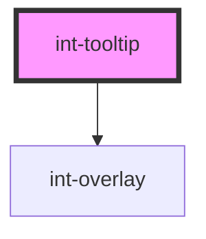

# int-tooltip

<!-- Auto Generated Below -->

## Properties

| Property   | Attribute  | Description | Type                                     | Default                |
| ---------- | ---------- | ----------- | ---------------------------------------- | ---------------------- |
| `arrow`    | `arrow`    |             | `boolean`                                | `undefined`            |
| `edge`     | `edge`     |             | `"bottom" \| "left" \| "right" \| "top"` | `undefined`            |
| `offsetX`  | `offset-x` |             | `number`                                 | `12`                   |
| `offsetY`  | `offset-y` |             | `number`                                 | `12`                   |
| `selector` | `selector` |             | `string`                                 | `'[data-int-tooltip]'` |

## Events

| Event                 | Description | Type               |
| --------------------- | ----------- | ------------------ |
| `integralHideTooltip` |             | `CustomEvent<any>` |
| `integralShowTooltip` |             | `CustomEvent<any>` |

## Dependencies

### Depends on

- int-overlay

### Graph

----------------------------------------------

*Built with [StencilJS](https://stenciljs.com/)*
